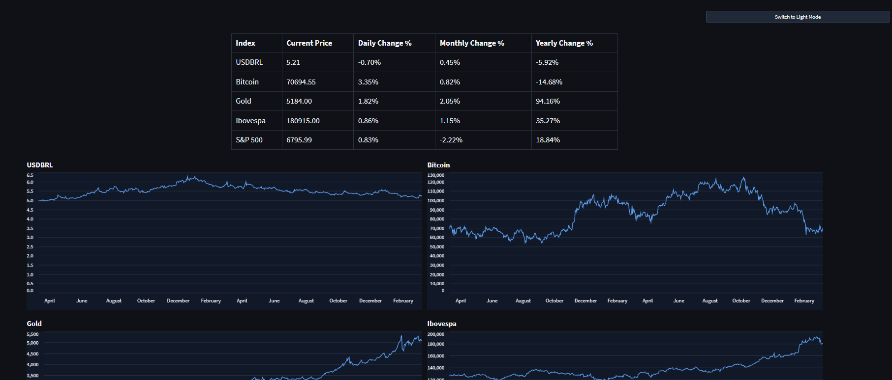

# Dashboard Indices



Watch the demo video: [dashboard_example.mp4](files/dashboard_example.mp4)

A compact Streamlit market dashboard that tracks a small set of assets and indexes in one screen. It fetches data from Yahoo Finance, summarizes current performance, and renders interactive price charts with a light/dark mode toggle.

## What it shows

- `USDBRL`
- `Bitcoin`
- `Gold`
- `Ibovespa`
- `S&P 500`

For each asset, the app displays:

- current price
- daily change
- monthly change
- yearly change
- an interactive two-year price chart

## Stack

- Python
- Streamlit
- yfinance
- pandas
- Altair

## Run locally

1. Create and activate a virtual environment.
2. Install dependencies:

```bash
pip install -r requirements.txt
```

3. Start the app:

```bash
streamlit run dashboard.py
```

Streamlit will print a local URL in the terminal, typically `http://localhost:8501`.

## Project structure

```text
.
|-- dashboard.py
|-- files/
|   |-- dashboard_example.mp4
|   `-- dashboard_example.png
|-- requirements.txt
|-- README.md
```

## How it works

- Data is downloaded with `yfinance`.
- Results are cached for 15 minutes to avoid unnecessary repeated requests.
- Summary metrics are calculated from the `Close` price series.
- Charts are rendered with Altair and arranged in a two-column layout.
- The UI theme can be switched at runtime using Streamlit session state.

## Notes

- Prices and percentage changes depend on Yahoo Finance data availability.
- Monthly and yearly changes are approximated using 30 and 365 trading-day offsets in the current implementation.
- If a symbol returns no data, the dashboard shows `N/A` for summary values.

## Customization

To change tracked assets, edit the `symbols` dictionary in `dashboard.py`.

To change the historical window, update the `period` argument passed to `get_data()`.

## Origin

This repository started as an experiment: build a usable dashboard through prompting, with the app logic generated iteratively in Codex (ChatGPT).
